# pyc_tuxingxue_graphics
图形学领域模型 用来进行测试 

资源来自:[text](https://casual-effects.com/g3d/data10/index.html#cite)    
 

## 说明   

Bedroom  

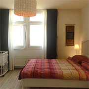

   
关闭网格中的孔后, 由fhernand使用RealityCapture使用546张照片(Nikon D7000, Tokina 11mm, f11, RAW格式, ISO 100)生成.  

Morgan McGuire调整了OBJ的材料.  
BMW   

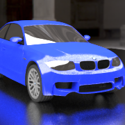

   
Mike Pan为Blender 2.7演示创建了该模型. Morgan McGuire用3DS Max校正了暴露的背面, 大多数孔, 网格互穿和材质, 并导出为OBJ格式. 原来有两辆带有弯角车轮的汽车. 此版本具有带默认姿势的车轮的单车, 可简化运行时动画.  
Breakfast Room   

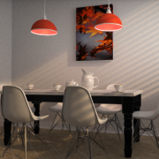

   
从Blender导出到OBJ, 并通过Morgan McGuire校正了材料和几何形状. 首先由Bitterli进行3D图形研究. 从http://www.blendswap.com/blends/view/75431下载的几何. 大理石纹理是https://hugolj.deviantart.com/art/White-Marble-Texture-500949943的公共领域.   
Happy Buddha   

    

Brian Curless和Marc Levoy使用Cyber​​ware 3030 MS扫描仪通过对真实物体进行多次范围扫描创建了该模型. Morgan McGuire将PLY从Georgia Tech转换为IFS, 计算了顶点法线, 然后使用G3D将其导出为OBJ格式. 该模型没有孔, 但由于进行空间雕刻而包含小的桥, 因此其拓扑属比看起来大

请参阅有关此模型在文化上适当使用的注释.    
Stanford Bunny   

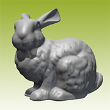

    

斯坦福·兔子
格雷格·特克(Greg Turk)和马克·勒沃伊(Marc Levoy)使用Cyber​​ware 3030 MS扫描仪通过对真实物体进行多次范围扫描创建了该模型. Morgan McGuire将文件转换为OBJ, 固定了孔, 计算了光滑的顶点法线, 并在3DS Max中创建了纹理参数化.https://www.cc.gatech.edu/~turk/bunny/bunny.html    
Cornell Box   

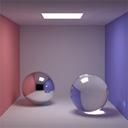

   
康奈尔盒子
唐纳德·格林伯格(Donald Greenberg)和康奈尔大学的学生创造了原始的物理"康奈尔盒子"并匹配了虚拟几何体. 几十年来, 它已用作计算机图形中用于真实感渲染的标准测试场景.

Guedis Cardenas, Morgan McGuire和Michael Mara创建了这八个OBJ文件, 这些文件表示基于该数据的一些最常用的测试场景. 这些包括原始的盒子 和Henrik Jensen的许多变体(图标图像是Jensen的), 例如装满水的盒子. 请注意, 原始的实盒并不是完美的立方体, 因此在此数据集中, 面相应地是不完美的    
Clouds   

    

乌云
使用SculptGL创建的五个多边形云壳模型, 它们首先出现在McGuire和Mara, 现象学透明性, IEEE可视化交易和计算机图形学, 编号1.2017年5月5日.   
Conference Room    

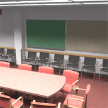

   
会议室
真正的劳伦斯·伯克利国家实验室90层3楼会议室的3D模型最初由Anat Grynberg和Greg Ward于1991年创建. 该模型是通过手动测量创建的, 坐标直接输入文本编辑器. 它通常用于全局照明实验.

该模型在历史上的某个时刻从内而外翻转, 并且在某些文件中相对于原始模型向后出现, 带有EXIT标志的阅读就像在镜子中一样. Vicarious Visions的Kenzie Lamar固定了所有表面上的面部缠绕方向, 使其保持一致, 对垃圾桶和灭火器进行了重新建模, 使其法线和接头合理, 无互穿, 用单个面板替换了散热器的通风孔, 并翻转了出口标志. 在Ward的原始渲染中可观察到的纹理(特别是在木纹中)是程序性的, 在此模型中未表示.

其他资源:

Anat Grynberg和Greg Ward 以RADIANCE格式撰写的原著
MGF格式的模型, 由Greg Ward转换    
Crytek Sponza    

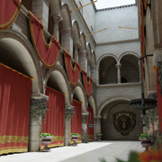

    

Crytek海绵
杜布罗夫尼克的中庭 Sponza宫, 由Marko Dabrovic的原创作品启发, 由Crytek的Frank Meinl重塑. 我使用了Meinl导出的OBJ版本, 使用normal2bump.cpp从法线贴图计算了凹凸贴图 (因为MTL文件期望的是高度变化, 而不是法线变化), 请将"蒙版"纹理放入关联的漫反射纹理的Alpha通道中, 清理蒙版中的噪点, 校正八边形花瓶的材质映射, 使用PNGcrush压缩纹理, 并移除了漂浮在文件中但没有发布的模型图像中的中庭中间漂浮的长长的无纹理横幅. 压缩文件包含横幅作为单独的对象.    

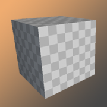

   
立方体
我手动创建的具有纹理坐标和显式顶点法线的立方体. 立方体以原点为中心并具有单位体积. 我包括了棋盘格纹理和材质映射, 以使其易于修改以将其他纹理放置在多维数据集上   
Dabrovic Sponza   

    

杜布罗夫尼克中庭Sponza宫. 最初是为渲染竞赛而创建的, 此后被全球照明社区采用为测试模型. 原始文件存在一些实质性问题, 其下载站点不再可用. Vicarious Visions的Kenzie Lamar将3DS文件转换为OBJ, 并将纹理坐标分配给了天花板. Morgan McGuire手绘了大多数表面的凹凸贴图. Dabrovic从未亲自授权该模型, 但他的说法似乎与CC BY-NC一致.   
Chinese Dragon   

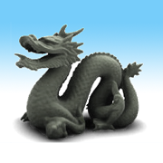

   

中国龙
我从Georgia Tech转换了PLY到IFS, 然后计算顶点法线, 然后使用自定义代码将结果写入OBJ格式. 该模型最初来自斯坦福3D扫描存储库. 它是由Cyber​​ware 3030 MS扫描仪从真实物体上扫描的. 通过斯坦福大学的扫描重建的模型包含更少的三角形和更多的顶点. 佐治亚理工学院的版本可能是与原始观点无关地重建的. 与本页上的许多模型一样, 我在加载过程中将位于同一位置的顶点与相同的法线合并后报告顶点数(即, 顶点缓冲区实际上将在内存中的大小), 因此我的顶点数小于一个由佐治亚理工学院(Georgia Tech)报道, 但我的脸数相同 图标图像来自NVIDIA.  
Erato   

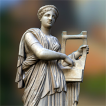

    

埃拉托
"埃拉托, 公元2世纪的蒙特卡沃, 大理石, Ny Carlsberg Glyptotek(丹麦哥本哈根). 用Memento Beta制造.

这位年轻女子的头上戴着花环, 右边和手臂上缠着一条大披风. 她扮演的是基塔拉琴或七弦琴, 可能是情色诗歌的缪斯女神埃拉托."   
Fireplace Room   

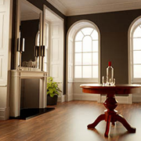

   
壁炉房
首先用于渲染研究, 然后由Benedikt Bitterli从Blender转换为Mitsuba / Tungsten / PBRT格式

由NVIDIA的Nicholas Hull转换为OBJ, 并由Williams College的Morgan McGuire校正了材料以匹配Bitterli的参考图像.    
Gallery   

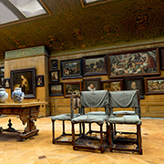

   
画廊
这是位于瑞典斯德哥尔摩Hallwyl博物馆顶层的图片库. 威廉米娜·冯·霍尔维伯爵夫人是荷兰和佛兰德黄金时代艺术品的敏锐收藏者. 艺术家和主题的多样性是荷兰和佛兰芒大师的Hallwyl House Collection的代表. 该收藏构成了荷兰艺术黄金时代的一种百科全书.

摩根·麦奎尔(Morgan McGuire)删除了背面, 旋转了方向使其与档案中的其他模型匹配, 将精度降低到1mm(以减少空间), 并与轴对齐.

文字: Annika Williams
扫描: Erik Lernest.l
最初发布于SketchFab上, 网址为https://sketchfab.com/models/231fdb3e9e354c6faaa3c250f8c9988f#    
Geodesics     

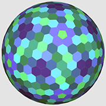

    

测地线
86个由正三角形, 六边形和五边形组成的测地线和双测地线多面体. 这些是二十面体及其对偶的细分. OBJ文件包含多面网格. 如果不将它们转换成带负载的三角形, 则可以访问原始的多面体. 使用反棱镜进行计算, 然后导出为OBJ格式并进行手动清理.   
Hairball   

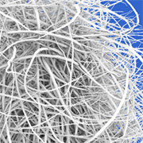

  
毛球
NVIDIA Research的Samuli Laine和Tero Karras为两种快速射线投射环境光遮挡方法创建了这种细线束.    

Holodeck   

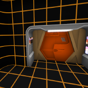

   
霍洛德克
由John William Telford为williamtelford@rocketmail.com 为G3D创新引擎创建的Holodeck模型, 以及NVIDIA Morgan Morgan的其他材料.   
Horse Chestnut Tree   

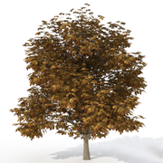

    

七叶树
由Xfrog使用他们的软件进行演示创建. 资源.   
Indonesian Statue    

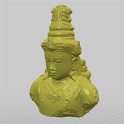

   
使用123D捕捉数字化f    
Lost Empire   

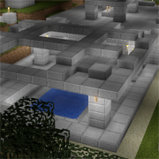

   
失落的帝国
我将这个地下印第安纳·琼斯风格的城市建模为Vokselia Minecraft世界的一部分, 然后使用Mineways(http://mineways.com)将其导出为OBJ格式. 全世界都拥有CC BY 3.0许可证, 该许可证仅允许注明出处使用. 该模型非常适合进行全局照明测试: 它大部分是白色的, 拓扑复杂的几何形状, 高度且规则地细分, 并且由于周围的山顶而完全位于"内部". 用Torch材料在每个三角形处放置光源可提供合理的照明.   
Living Room   

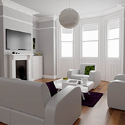

    

客厅
Benedikt Bitterli首先将其用于渲染研究, 然后从Blender转换为Mitsuba / Tungsten / PBRT格式.

由NVIDIA的Nicholas Hull转换为OBJ, 并由Williams College的Morgan McGuire校正了材料以匹配Bitterli的参考图像. 在Blend Swap上创作时最初称为" The White Room Cycles" .    
LPS Head   

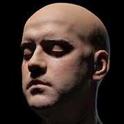

   
LPS头
无限现实总监Lee Perry-Smith创建了他的头部的3D扫描. 威廉姆斯学院的Morgan McGuire和Guedis Cardenas将置换文件从.tif转换为16位.png, 并创建了凹凸贴图的低分辨率版本. 我们设置了.mtl文件的纹理贴图, 绘制了凹凸贴图, 以使其在头部后部无缝, 并调整了默认的光泽高光以更好地模拟3D头部.    \
Mori Knob    

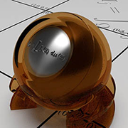

    

森诺伯
森靖康创造了这种光传输材料测试球. 威廉姆斯学院的Morgan McGuire将其从搅拌机转换为OBJ + MTL格式, 在几何中固定互穿, 并添加了G3D铰接模型文件. Syoyo Fujita预览渲染.     
Mitsuba Knob   

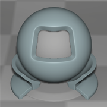

    

三叶旋钮
这是Mitsuba渲染器随附的标准材料测试对象. 在Wenzel Jakob的允许下, 我们将其转换为单个OBJ文件并分离了背景. 该数据由Wenzel Jakob提供, 目的是在Mitsuba渲染器与其他渲染器之间进行直接比较. 请不要将此用于其他目的, 例如您自己的渲染器中的标准测试对象.     
Power Plant    

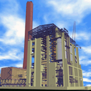

   

发电厂
电厂模型是实际燃煤电厂的完整模型. 它已发布, 仅用于非商业用途. UNC将该模型分发为1, 185个PLY文件, 大概是因为十年前发布时, 系统无法像今天一样管理数百万个多边形. 威廉姆斯学院的Morgan McGuire和Guedis Cardenas将它们合并为一个OBJ文件, 并创建了一个适当的MTL文件.    
Road Bike   

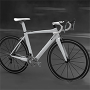

   
公路自行车
森康康从他的github存储库中以OBJ格式导出提供了此模型. Morgan McGuire调整了基于物理渲染的材质. 座椅和制动器的背面有些裸露.   
Rungholt    

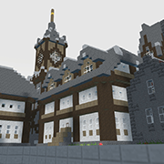

    

朗霍特
Minecraft地图上的Neu Rungholt中世纪村落, 由" kescha"创建, 题为" Alone in the dark", 他说:"随意将地图或其中的一部分用于您自己的项目."我将其转换为OBJ使用Mineways格式(http://mineways.com)这是一个很好的中等高度多边形模型, 因为它具有非常规则的细分.   
Salle de Bain   

   
萨恩·德·贝恩
首先由Benedikt Bitterli进行渲染研究. 由NVIDIA的Nicholas Hull和Williams College的Morgan McGuire转换为OBJ.   
San Miguel 2.0    

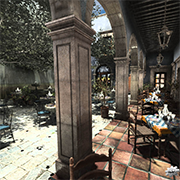

   
圣米格尔2.0
此zip文件中有两个版本的模型. 其中之一是对PBRT手册中发布的San Miguel模型进行清理. 另一个是更适合实时渲染的低多边形版本.

该场景最初由Evolucien Visual的Guillermo M. Leal Llaguno建模, 基于他在墨西哥圣米格尔德阿连德参观的一个庄园. 在Llaguno先生的许可下, 威廉姆斯学院的Morgan McGuire, Guedis Cardenas和Michael Mara以及NVIDIA的Nicholas Hull对2017年的版本进行了改进.

我们从吉列尔莫(Guillermo)的原始3DS Max文件开始, 然后将其实例化为原始格式, 以便于研究使用. 然后, 我们将其导出为OBJ文件, 更正了几何图形和材质, 将材质转换为PNG并集成了Alpha遮罩, 并构造了一个低多边形版本.

例如, 在PBRT2书的封面上, 您可以看到喷泉中有椅子, 桌子上没有腿. 我们修复了这些以及更多问题.    
Scrub Pine Tree   

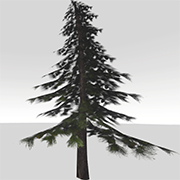

   
磨砂松树
首次用于Wyman和McGuire的渲染研究, Hashed Alpha Testing, ACM SIGGRAPH交互式3D图形和游戏专题研讨会, 2017年2月25日, 共11页.    
Serapis Bust   

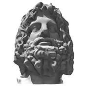

   

塞拉皮斯胸围
塞拉皮斯(Serapis)团长, 罗马(埃及巴里亚纳)1世纪. 由Todd Blatt在沃尔特美术馆的Art Bytes Hackathon上捕获. 资源.    
Sibenik Cathedral  

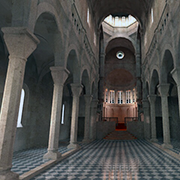

    

希贝尼克大教堂
马克贝·达布罗维奇(Marko Dabrovic)创作的希贝尼克(Sibenik), 孔泽(Visious Visions)的肯齐·拉马尔(Kenzie Lamar)校正了孔, 摩根·麦奎尔(Morgan McGuire)绘制了高分辨率的纹理和凹凸贴图. 图标图像由Aleksander Stompel提供.   
Lat-Long Sphere  

    

长球体
由经纬度投影创建的16k, 4k和1k多边形球体, 具有圆柱纹理坐标. 包括世界地图和棋盘材料.    
Sports Car   

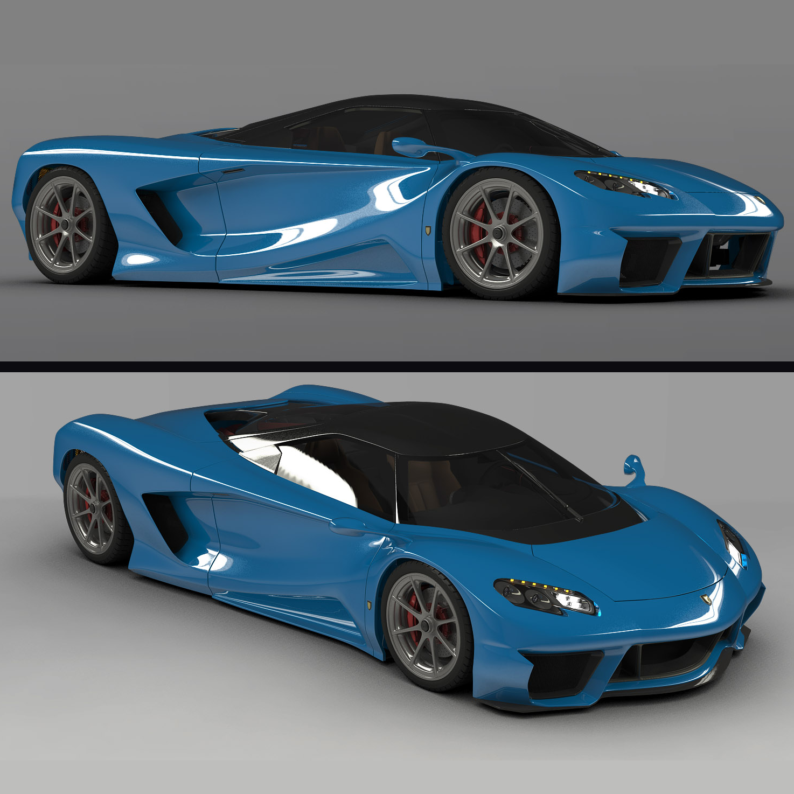

    

跑车
Jamie Lesser将Mora的Maya文件从Yasutoshi Mori的github存储库转换为OBJ格式.    
Sibenik Cathedral
SiTeapot   

   

茶壶
马丁·纽维尔(Martin Newell)于1975年使用双三次贝塞尔曲线贴片对茶壶进行建模, 作为整个茶具的一部分. 它首先出现在他的博士学位中. 论文. 吉姆·布林(Jim Blinn)将茶壶水平缩放1.3倍, 以消除矩形像素在其显示屏上的影响. 原来没有底. 大多数变体加一个.

Vicarious Visions的Kenzie Lamar使用3D Studio Max中的默认茶壶模型创建了此版本. 他调整了顶部的大小, 使其紧密贴合, 创建了一个外壳, 并焊接了喷嘴和手柄, 从而使茶壶成为无边界的歧管, 并为整个模型创建了唯一且分辨率一致的纹理参数.    
Vokselia Spawn    

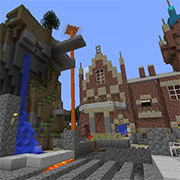

   

Vokselia Spawn
由Vokselia Minecraft世界的作者(主要是SIGGRAPH的贡献者和工程师)创建. 由Eric Haines使用Mineways从Minecraft导出.    
White Oak Tree   

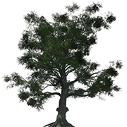

   

白橡树
在SpeedTree中为NVIDIA ORCA系列创建. Morgan McGuire从FBX导出到OBJ, 然后手动折叠纹理贴图以具有alpha通道和唯一的法线贴图.    
Amazon Lumberyard Bistro   

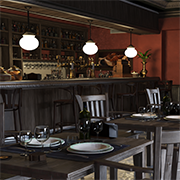

   

亚马逊Lumberyard Bistro
由Amazon Lumberyard创建, 用于2017 GDC演示. 在NVIDIA ORCA系列中公开发布. 外部包含2, 837, 181个三角形和2, 910, 304个顶点. 内部包含1, 020, 907个三角形和762, 263个顶点.

此版本由Morgan McGuire手动修复了一些材料, 以纠正从Lumberyard导出的原始OBJ的局限性, 并拆分为多个zip文件以简化下载过程. 将每个文件解压缩到同名目录中或直接加载压缩文件使用G3D创新引擎.   
